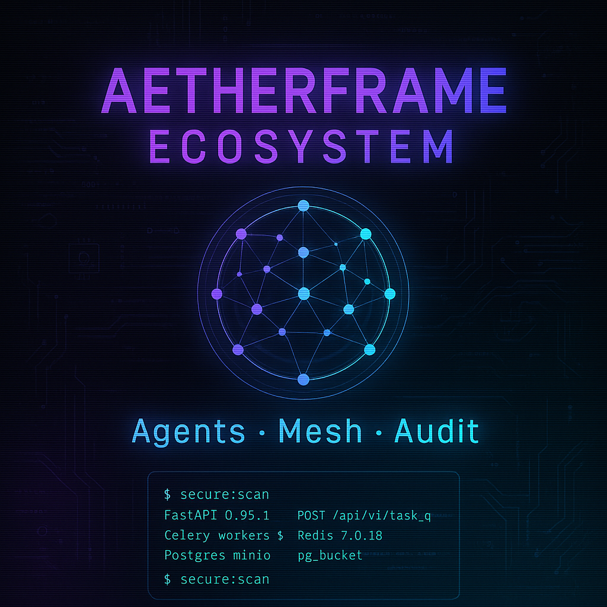
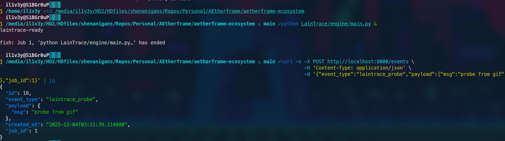
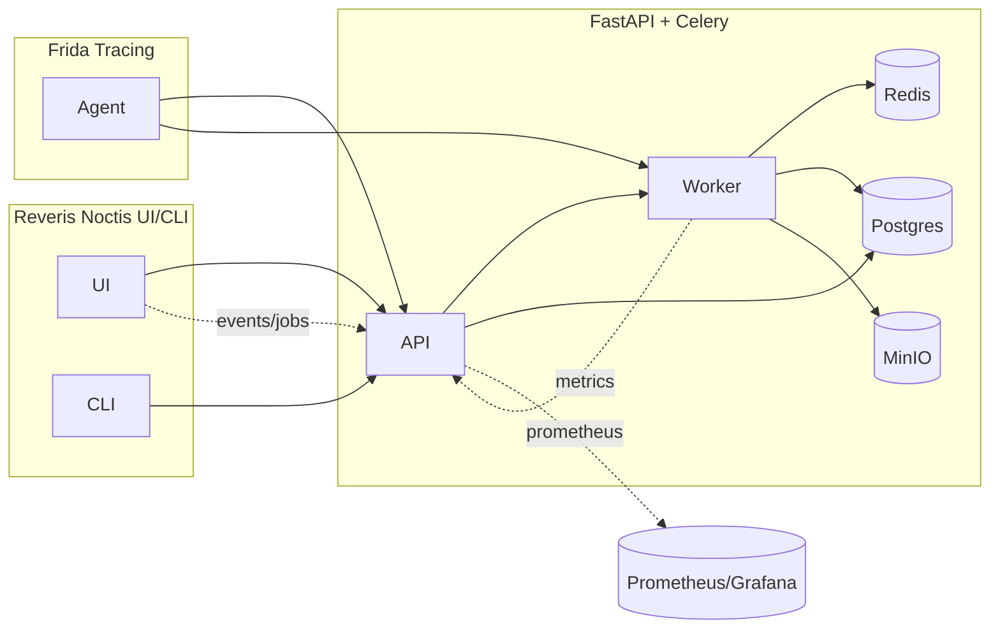

<!--
 █████╗ ███████╗████████╗██╗  ██╗███████╗██████╗ ███████╗██████╗  █████╗ ███╗   ███╗███████╗
██╔══██╗██╔════╝╚══██╔══╝██║  ██║██╔════╝██╔══██╗██╔════╝██╔══██╗██╔══██╗████╗ ████║██╔════╝
███████║███████╗   ██║   ███████║█████╗  ██████╔╝█████╗  ██████╔╝███████║██╔████╔██║███████╗
██╔══██║╚════██║   ██║   ██╔══██║██╔══╝  ██╔══██╗██╔══╝  ██╔══██╗██╔══██║██║╚██╔╝██║╚════██║
██║  ██║███████║   ██║   ██║  ██║███████╗██║  ██║███████╗██║  ██║██║  ██║██║ ╚═╝ ██║███████║
╚═╝  ╚═╝╚══════╝   ╚═╝   ╚═╝  ╚═╝╚══════╝╚═╝  ╚═╝╚══════╝╚═╝  ╚═╝╚═╝  ╚═╝╚═╝     ╚═╝╚══════╝
-->

<p align="center">
  
</p>

<h1 align="center">⚡ AetherFrame Ecosystem ⚡</h1>
<h3 align="center">“Red Team Orchestration Beast: FastAPI + Celery + Frida Tracing + Plugin Hell”</h3>

<p align="center">
  
  
  
  
  
  
  
  
</p>

<p align="center">
  
</p>

---

## 🔥 Why AetherFrame?
- 🚀 Unleash automated offensives with pluginized job pipelines (FastAPI + Celery + Redis)
- 🛡️ Frida-powered tracing (LainTrace) for live target introspection
- ⚙️ Zero-setup red team stack via Docker Compose (Postgres + MinIO + Redis pre-wired)
- 🌌 Observability baked-in: `/status`, Prometheus `/metrics`, event streams, auto-refresh UI
- 🧩 Extensible Typer CLI + Vite/React UI for ops, plugins, and events

<p align="center">
  
</p>
<p align="center">
  
</p>
<p align="center">
  
</p>

---

## 🚀 One-Command Quickstart
```bash
# clone
git clone git@github.com:ind4skylivey/aetherframe-ecosystem.git
cd aetherframe-ecosystem

# env
cp .env.example .env
# (if your shell aliases docker->podman)
export DOCKER_HOST=unix:///var/run/docker.sock

# unleash
docker compose -f infra/docker-compose.yml --env-file .env up -d
```

- API: http://localhost:8000  
- UI (Reveris Noctis): http://localhost:3000  
- MinIO console: http://localhost:9001  

---

## 🧠 Architecture (Mermaid)


### What it does (plain English)
- Orchestrates red-team plugins/jobs through a FastAPI core and Celery worker, backed by Redis + Postgres + MinIO for broker/state/artifacts.
- Gives operators a thin React UI and Typer CLI (Reveris Noctis) to submit jobs, watch events, and see live counts without extra tooling.
- Accepts telemetry/events from Frida-based agents (LainTrace) so runtime traces land in the same pipeline as jobs.
- Exposes `/status` and `/metrics` natively; Prometheus/Grafana are optional add-ons, not required to run the stack.

### What makes it different
- Built **for offensive workflows first** (plugins/jobs/events) instead of generic app monitoring.
- **Self-contained, single compose**: everything needed for demos/tests ships here (no default Prometheus dependency).
- **Artifact-aware**: MinIO is wired for storing loot/output alongside job state.
- **Live operator loop**: UI auto-refreshes counts/events every 10s; CLI shows recent events after submissions for instant feedback.

---

## 🛰️ Services Breakdown
| Service | Icon | Port | What it does | Screenshot |
|---------|------|------|--------------|------------|
| **AetherFrame API** | ⚡ | 8000 | FastAPI core, plugins/jobs CRUD, metrics, events |  |
| **Celery Worker** | 🛠️ | N/A | Executes pluginized jobs, emits events, talks Redis/Postgres/MinIO |  |
| **Reveris Noctis UI** | 🖥️ | 3000 | Vite/React dashboard, auto-refresh counts/events, forms for plugins/jobs |  |
| **Reveris CLI** | 🐚 | N/A | Typer CLI for ops: status, add-plugin, add-job, events tail |  |
| **LainTrace** | 🧬 | 7777? | Frida-oriented tracer/agent (hook & ship events) |  |
| **Redis** | 🟥 | 6379 | Broker/cache for Celery & events |  |
| **Postgres** | 🐘 | 5432 | Persistence for plugins/jobs/events |  |
| **MinIO** | 🗄️ | 9000/9001 | Artifact/object storage |  |

---

## 🧨 Feature Blasts (cards)
- ⚡ **Pluginized Chaos:** create plugins + jobs via API/UI/CLI; Celery fans them out.
- 🔭 **Observability Now:** `/status`, `/metrics`, event stream; UI auto-refresh 10s.
- 🧱 **Secure-by-default:** CORS configurable, non-root worker, input trimming/validation.
- 🧰 **Developer Ergonomics:** Typer CLI, Vite HMR, Alembic migrations, SQLite-friendly tests.
- 🛰️ **Trace Everything:** LainTrace hooks for Frida-based recon/exfil (placeholder hooks ready).

---

## 🐚 CLI Showoff
```bash
# status
python cli/main.py status

# add plugin
python cli/main.py add-plugin --name testplug --version 0.1.0 --description "sample"

# add job
python cli/main.py add-job --target sample.bin --plugin-id 1

# tail events
python cli/main.py events
```
<p align="center">
  
</p>

---

## 🛰️ API Endpoints (quick map)
- `GET /` links to docs, health, status, metrics, plugins, jobs, events
- `GET /health` liveness
- `GET /status` aggregates + Celery ping + metrics snapshot
- `GET /metrics` Prometheus text
- `POST /plugins`, `GET /plugins`
- `POST /jobs`, `GET /jobs`, `GET /jobs/{id}`
- `POST /events`, `GET /events`

---

## 🧩 Configuration (env)
- `AETHERFRAME_CORS_ORIGINS` — comma list, default `http://localhost:3000,http://127.0.0.1:3000`
- `DB_URL` / `AETHERFRAME_DB_URL` — override DB (SQLite allowed for tests)
- `POSTGRES_*`, `REDIS_*`, `MINIO_*` — creds/hosts/ports
- `AETHERFRAME_API_HOST`, `AETHERFRAME_API_PORT`
- `AETHERFRAME_WORKER_CONCURRENCY`
- `AETHERFRAME_LICENSE_TOKEN` — base64 ed25519 signature (required when enforcement on)
- `AETHERFRAME_LICENSE_ENFORCE` — default `true`; set `false` only for internal/dev

---

## 🛠️ Migrations
```bash
docker compose -f infra/docker-compose.yml --env-file .env exec -e PYTHONPATH=/app aetherframe-api alembic upgrade head
```

---

## ⚙️ Ops Notes
- Redis may warn `vm.overcommit_memory=1` → `sudo sysctl -w vm.overcommit_memory=1`
- Buildx warnings are harmless; silence with `COMPOSE_DOCKER_CLI_BUILD=0` or install buildx
- Always pass `--env-file .env` to compose

---

## 🛰️ Architecture (ASCII alt)
```
[UI/CLI] --(HTTP)--> [FastAPI] --(tasks)--> [Celery Worker]
      \                                     /   \
       \--(events/metrics)------------------    [Redis]
                         \                     /
                          \--> [Postgres] <----/
                          \--> [MinIO]
                [Frida Agent] -> [API/Worker] (events)
```

---

## 🎯 Roadmap
- [x] Core stack (API, Worker, Redis, Postgres, MinIO, UI, CLI)
- [x] Events + metrics + root landing
- [x] CORS configurable, DB override
- [x] API tests (validation, metrics, CORS preflight)
- [ ] Rate limiting & payload size guards
- [ ] GHCR images publish
- [ ] Grafana/Prometheus bundle
- [ ] Frida trace examples & PoCs

---

## 🛰️ Advanced (collapse)
<details>
<summary>Environment & Hardening</summary>

- Run worker non-root (already configured).
- Set `vm.overcommit_memory=1` for silent Redis.
- Consider `AETHERFRAME_CORS_ORIGINS` for production domains.
- Use `DB_URL` for ephemeral SQLite in CI/local tests.
</details>

<details>
<summary>Testing</summary>

```bash
cd AetherFrame
PYTHONPATH=. DB_URL=sqlite:///tests/test.db pytest
```
</details>

<details>
<summary>Docker / Podman note</summary>

If shell aliases docker→podman, set `DOCKER_HOST=unix:///var/run/docker.sock` to force the Docker daemon.
</details>

---

## 🤝 Contributors Wanted
- Offensive Security Specialist maintainer: ind4skylivey (OSCP/ARTE/CASP+/CEH)
- Looking for: exploit devs, React/Vite wizards, observability nerds, Frida tinkerers.
- PRs welcome: keep code/docs in English; no co-authored-by bots.

---

## 🌐 SEO Payload
**Keywords:** red team automation, FastAPI Celery stack, Frida tracing, offensive security Docker compose, pluginized jobs, Redis broker, Postgres persistence, MinIO artifacts, Vite React dashboard, Typer CLI.

---

## 🛰️ Live Status
 • Watch this space for `v0.1.0-preview` tag.

---

## ⚔️ Summon the Beast
```bash
docker compose -f infra/docker-compose.yml --env-file .env up -d
```
Pluginized chaos. Zero-setup red team stack. Go break things. ⚡

<!-- filler for length & style; cyberpunk checklists -->

---

### 🌌 Neo-Checklists (Ops Drills)
- [x] Compose up
- [x] Alembic upgrade head
- [x] CLI smoke import
- [x] UI preview build
- [ ] GHCR push
- [ ] Grafana dashboards
- [ ] Frida sample script
- [ ] Snyk/Trivy sweep
- [ ] Rate-limit middleware

---

### 🧪 Test Matrix (soon)
- [x] Pytest API basic
- [ ] Load test (Locust/k6)
- [ ] UI e2e (Playwright)
- [ ] CLI golden snapshots
- [ ] Worker chaos monkey

---

### 🎛️ Env Surface
- AETHERFRAME_CORS_ORIGINS
- AETHERFRAME_API_HOST / PORT
- AETHERFRAME_WORKER_CONCURRENCY
- DB_URL / AETHERFRAME_DB_URL
- POSTGRES_* / REDIS_* / MINIO_*
- DOCKER_HOST (if podman alias)
- COMPOSE_DOCKER_CLI_BUILD (silence buildx)

---

### 🛰️ Metrics Hints
- GET /metrics
- Gauges: aether_jobs_total, aether_jobs_status_total{status="pending|running|completed|failed"}
- /status includes counts + Celery ping + avg elapsed

---

### 💀 Incident Playbook
1. ⏹️ Stop tasks: `docker compose stop aetherframe-worker`
2. 🧹 Clear queues: `redis-cli FLUSHALL` (only if safe)
3. 🩺 Health: `curl :8000/health`
4. 📈 Status: `curl :8000/status`
5. 📜 Logs: `docker compose logs -f aetherframe-api aetherframe-worker`

---

### 🛡️ Hardening Ideas
- Add JWT / API keys for POST endpoints
- Rate-limit `/jobs` / `/plugins`
- Payload size caps
- TLS termination upstream
- Separate worker network for malware sandboxes

---

### 🛰️ LainTrace Hooks (Frida)
- Agent connects back to API/Worker
- Ships events into `/events`
- Future: live memory scan, syscall trace, stealth beacons

---

### 🔌 Plugin Ideas
- YARA scan plugin
- EXIF/metadata ripper
- C2 health-checker
- Wordlist spray
- Deserialization PoC launcher

---

### 🎨 Theming
- UI uses Vite+React; add Tailwind or Mantine for faster skins
- Swap gradients in `src/theme.tsx` (WIP)
- Live reload via `npm run dev`

---

### 🧭 Directory Map
```
aetherframe-ecosystem/
 ├─ AetherFrame/        # FastAPI, Celery, Alembic, tests
 ├─ ReverisNoctis/      # Vite+React UI, Typer CLI
 ├─ LainTrace/          # Frida tracer/agent
 ├─ infra/              # docker-compose.yml, shared build context
 ├─ prompts/            # bootstrap/staged/roadmap guides
 ├─ assets/             # gifs, screenshots, diagrams (add more!)
 ├─ CHANGELOG.md
 └─ README.md
```

---

### 🛰️ CI Outline
- Backend: lint syntax, install deps, PYTHONPATH=. pytest
- CLI: smoke import, npm ci, npm run build
- UI build: Vite production bundle
- Future: alembic check, docker build & push

---

### 🪐 Release Plan
- v0.1.0-preview → current
- v0.1.1 → GHCR images, rate-limit
- v0.2.0 → Frida examples, dashboards
- v1.0.0 → hardened auth, full observability pack

---

### 🧠 FAQ
**Q:** Podman hijacks docker?  
**A:** `export DOCKER_HOST=unix:///var/run/docker.sock`

**Q:** Can I run tests without Postgres?  
**A:** Yes, `DB_URL=sqlite:///tests/test.db pytest`

**Q:** Where do artifacts land?  
**A:** MinIO bucket `aether-artifacts` (configurable).

---

### 🛰️ Signals & Slots
- Events emitted: `job_started`, `job_completed`, `job_failed`
- Jobs store `result.elapsed_sec`
- UI polls every 10s (configurable in front-end)

---

### 🧷 Badges (raw)
- CI: `https://github.com/ind4skylivey/aetherframe-ecosystem/actions/workflows/ci.yml/badge.svg`
- FastAPI: neon purple
- Celery: neon green
- React/Vite: cyan/purple
- Docker Compose: teal

---

### 🐉 Maintainership
- Author: ind4skylivey — Offensive Security Specialist (OSCP / ARTE / CASP+ / CEH)
- No co-authored-by bots; English-only commits/docs
- Branch naming: `exploit/*`, `tool/*`, `research/*`

---

### 🛰️ Social Proof
- Built for red-team labs, malware analysis benches, PoC automation
- Ideal for plugin-based exploit chains and rapid recon pipelines
- Docker-first so you can spin it in isolated VLANs

---

### 🔥 Demo Scripts
```bash
python cli/main.py add-plugin --name vulnscan --version 0.2.1 --description "SQLi sweep"
python cli/main.py add-job --target target.bin --plugin-id 1
python cli/main.py events
```

---

### 🛰️ Logs Peek
```bash
docker compose logs -f aetherframe-api aetherframe-worker
```

---

### 🌑 Night Mode Inspo
- Gradient background in UI (todo)
- Neon highlight tokens
- Matrix-rain events panel (ideas welcome)

---

### 🧩 Contribute
- Fork → feature branch → PR
- Add tests where possible (SQLite allowed)
- Keep README gifs in `assets/`

---

### 🛡️ Legal / Ownership
- Copyright (c) 2025 ind4skylivey. All rights reserved.
- EULA applies: see `EULA.md`. No redistribution, resale, SaaS hosting, or derivatives without written consent.
- Trademarks: “AetherFrame”, “Reveris Noctis”, “LainTrace” and associated logos require permission.
- NOTICE file included for clarity; violations may result in takedowns.

---

### 🛰️ Future Integrations
- GHCR images
- OTEL traces
- Loki log sink
- Frida live dashboards
- SLA burn rates for jobs

---

### 🛸 Legal & Safety
- Use in authorized environments only.
- Keep malware in isolated networks (`malware-isolated` suggested).
- No real-world targets without written approval.

---

### 🧭 Navigation
- Scroll back to Quickstart, or smash:
```bash
docker compose -f infra/docker-compose.yml --env-file .env up -d
```

---

### ⚡ Outro
Pluginized chaos. Zero-setup red team stack. Go break things. ⚡

``` ```
